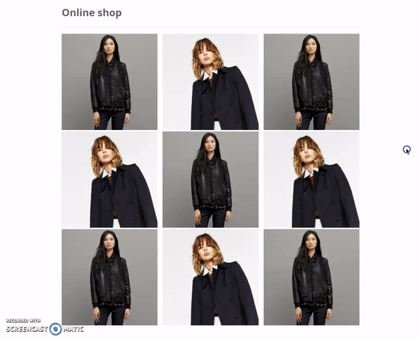
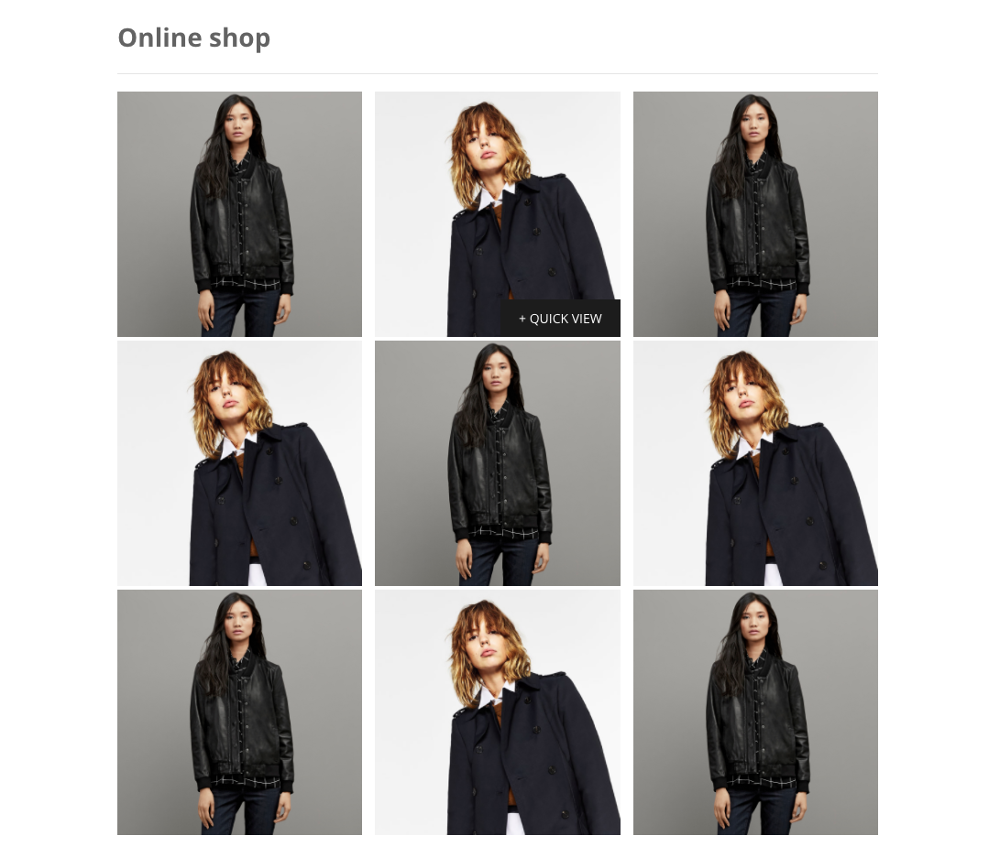
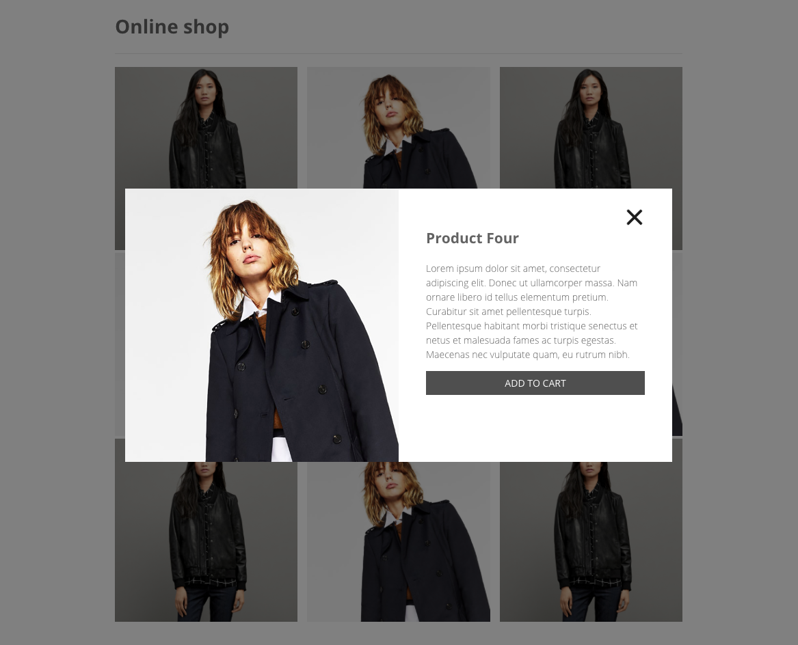

# Product Quick View plugin

Product Quick View allows users to get a quick look of products without opening the product page.


## Demo

A Product Quick View modal window, animated using CSS3 and jQuery, that provides the user a quick access to the main product information.

Aiming to increase the conversion rate by simplifying the user experience on our e-commerce platforms, we have created simple Product Quick View plugin. It gets triggered by clicking on the quick view button to fire a modal with additional information and a call-to-action button. 

#### Here is a quick animation to show you how it works: 


#### Screenshots:





## SASS

SASS in this project is compiled with npm scripts by running ```npm run build:css```
